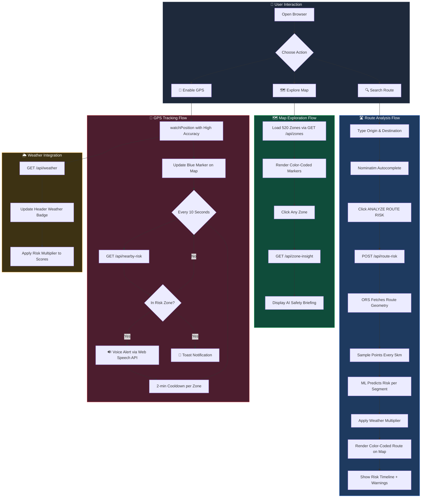
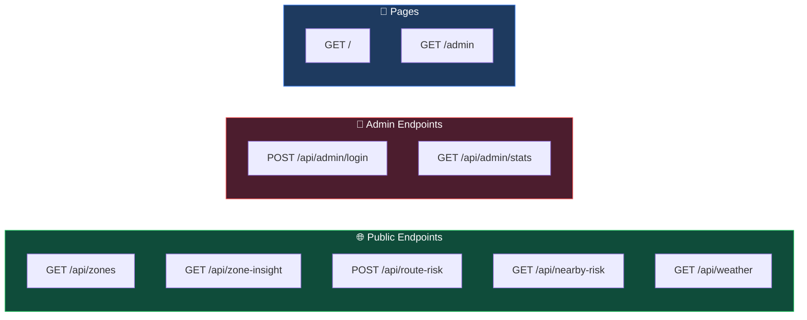
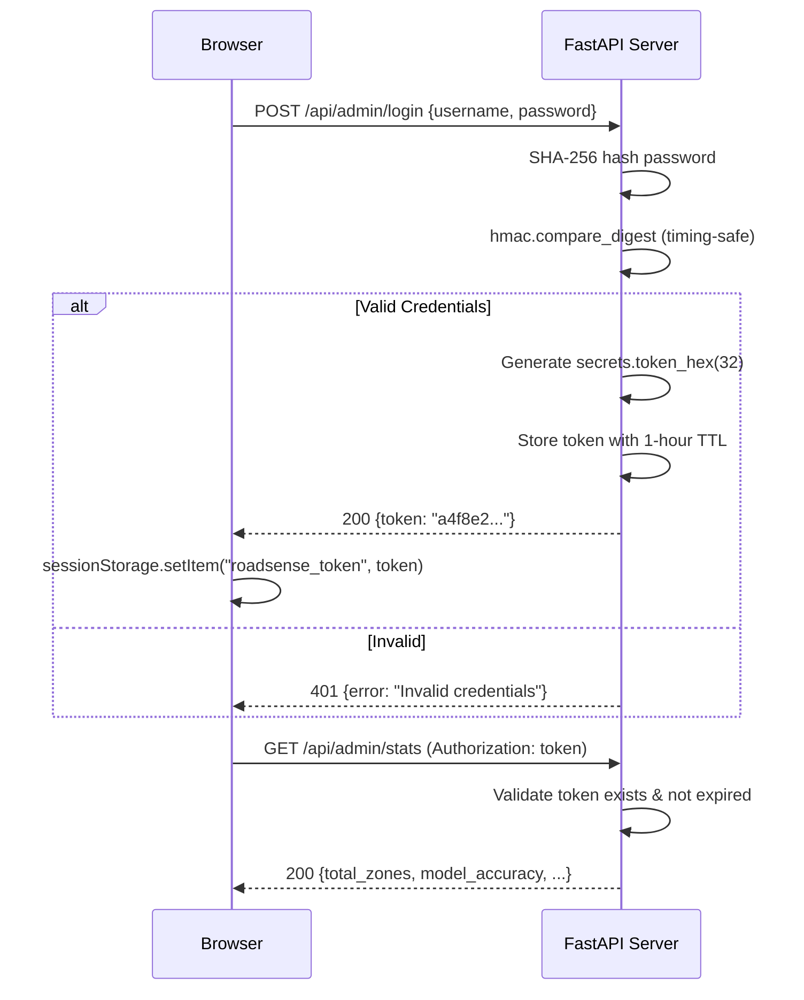
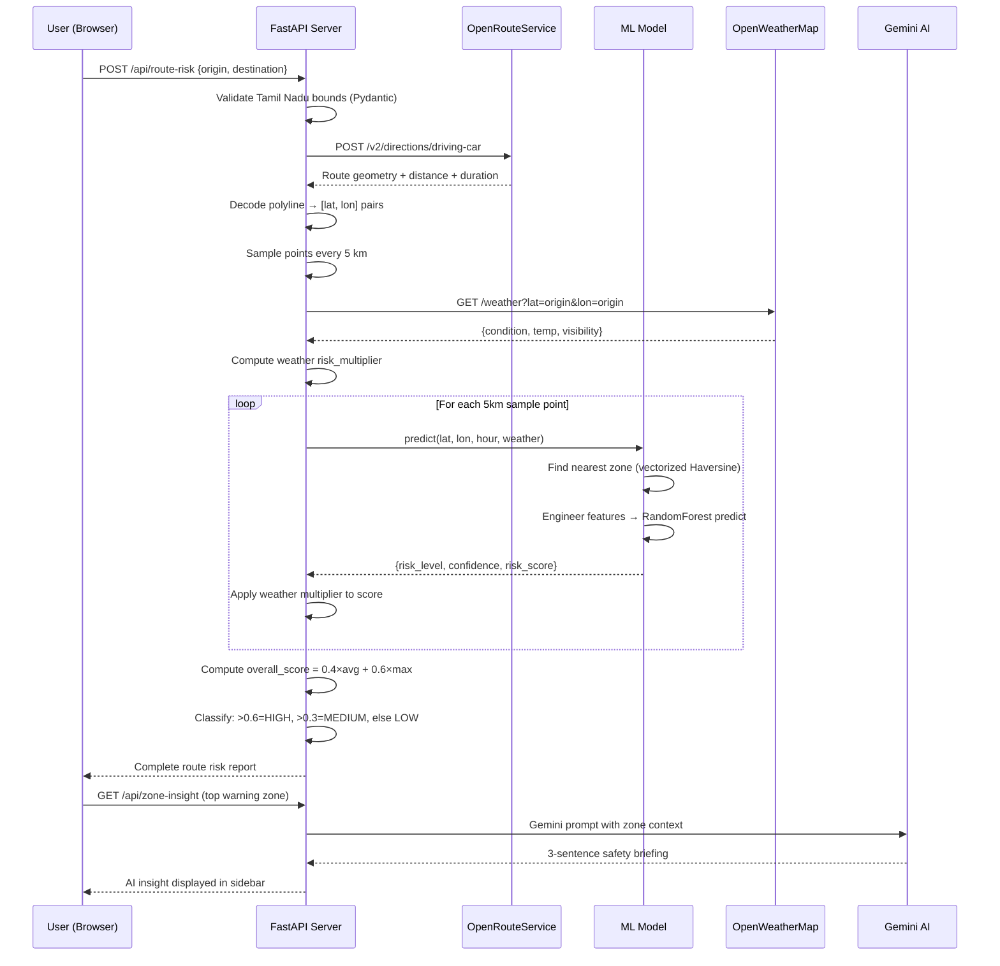

<div align="center">


# 🛡️ SafeRoute-AI

### Intelligent Accident Risk Navigation System for Tamil Nadu

[](https://python.org)
[](https://fastapi.tiangolo.com)
[](https://scikit-learn.org)
[](https://ai.google.dev)
[](https://leafletjs.com)
[](LICENSE)

**Real-time ML-powered road safety intelligence covering 520+ accident hotspot zones across all 37 districts of Tamil Nadu**

[🚀 Quick Start](#-quick-start) · [📖 Documentation](#-system-architecture) · [🔌 API Reference](#-api-reference) · [🛠️ Admin Panel](#-admin-dashboard)

---

</div>

## 🎯 What is SafeRoute-AI?

SafeRoute-AI is a **full-stack intelligent navigation system** that predicts road accident risk in real time using **machine learning**, **AI-powered safety briefings**, **live weather data**, and **interactive mapping**. It analyzes any route within Tamil Nadu and provides segment-by-segment risk scoring, spoken voice warnings when approaching danger zones, and contextual safety advice powered by Google Gemini AI.

> **The Problem:** Tamil Nadu records one of India's highest road accident fatality rates. Drivers have no awareness of approaching high-risk zones until it's too late.
>
> **The Solution:** SafeRoute-AI transforms historical accident data into actionable, real-time safety intelligence — warning drivers *before* they enter danger zones with AI-generated briefings, voice alerts, and weather-adjusted risk scores.

---

## ✨ Key Features

<table>
<tr>
<td width="50%">

### 🗺️ Interactive Risk Map
- **520 color-coded accident zones** rendered on a Leaflet.js canvas map
- Bounded to Tamil Nadu (8.0°–13.6° N, 76.0°–80.5° E)
- Click any zone for detailed statistics popup
- Radius-based zone coverage visualization

### 🤖 AI Safety Analyst
- **Google Gemini 2.0 Flash** generates contextual 3-sentence safety briefings
- Context-aware prompts include location, time, weather, and accident cause
- LRU cache (500 entries) prevents redundant API calls
- Intelligent fallback templates when Gemini is unavailable

### 🛣️ Route Risk Scoring
- End-to-end route analysis via **OpenRouteService**
- Samples every **5 km** along the route polyline
- Weather multipliers applied per segment
- Color-coded risk timeline visualization

### 🔊 Voice Alerts
- **Web Speech API** (`en-IN` locale) spoken warnings
- Triggers on entering HIGH-risk zones
- 2-minute cooldown per zone to prevent alert spam

</td>
<td width="50%">

### 🧠 ML Risk Prediction
- **RandomForestClassifier** (200 trees, balanced classes)
- 6-feature engineering pipeline with live weather integration
- 5-fold cross-validation: **~98.65% ± 1.68% accuracy**
- Vectorized Haversine for nearest-zone lookup

### 📍 Real-Time GPS Tracking
- `watchPosition()` with high-accuracy mode
- Nearby risk polling every **10 seconds**
- Auto-updates weather badge for current location
- Blue pulsing marker on map

### 🌦️ Weather-Aware Risk
- **OpenWeatherMap** integration with 10-min LRU cache
- Dynamic risk multipliers:
  - ☀️ Clear → `1.0×`
  - 🌧️ Rain → `1.3×`
  - 🌫️ Fog → `1.6×`
  - ⛈️ Storm → `2.0×`

### 🔐 Admin Dashboard
- Server-side SHA-256 token authentication
- API health checks for all 6 endpoints
- Searchable dataset explorer (520 zones)
- Live console with color-coded activity log

</td>
</tr>
</table>

---

## 🏗️ System Architecture

```
 ┌─────────────────────────────────────────────────────────────────────────┐
 │                          CLIENT  (Browser)                              │
 │                                                                         │
 │   ┌─────────────┐   ┌──────────────┐   ┌─────────────┐   ┌──────────┐ │
 │   │ Leaflet.js  │   │  Web Speech  │   │  Nominatim  │   │   GPS    │ │
 │   │ Map Engine  │   │  Voice Alert │   │  Geocoder   │   │ Tracking │ │
 │   │ (Canvas)    │   │  (en-IN)     │   │  (TN bbox)  │   │ (10s)    │ │
 │   └──────┬──────┘   └──────┬───────┘   └──────┬──────┘   └────┬─────┘ │
 │          │                 │                   │               │       │
 │   ┌──────┴─────────────────┴───────────────────┴───────────────┴─────┐ │
 │   │              index.html  ·  admin.html                           │ │
 │   │        XSS-safe rendering  ·  SessionStorage auth               │ │
 │   └───────────────────────────┬──────────────────────────────────────┘ │
 └────────────────────────────────┼───────────────────────────────────────┘
                                  │  HTTP / JSON  (REST API)
 ┌────────────────────────────────┼───────────────────────────────────────┐
 │                     FastAPI  Server  v2.1                               │
 │                                                                         │
 │   ┌──────────────┐   ┌─────────────────────────┐   ┌────────────────┐  │
 │   │  Security    │   │    8 API Endpoints       │   │   Lifespan     │  │
 │   │  Middleware  │   │                           │   │   Manager      │  │
 │   │  ─────────── │   │  GET  /api/zones          │   │  ───────────── │  │
 │   │  X-Frame     │   │  GET  /api/zone-insight   │   │  Preloads ML   │  │
 │   │  X-Content   │   │  POST /api/route-risk     │   │  model + data  │  │
 │   │  Referrer    │   │  GET  /api/nearby-risk    │   │  on startup    │  │
 │   │              │   │  GET  /api/weather         │   │                │  │
 │   │  CORS:       │   │  POST /api/admin/login    │   │                │  │
 │   │  GET, POST   │   │  GET  /api/admin/stats    │   │                │  │
 │   └──────────────┘   └───────────┬─────────────┘   └────────────────┘  │
 │                                  │                                      │
 │          ┌───────────────────────┼───────────────────────┐              │
 │          │                       │                       │              │
 │          ▼                       ▼                       ▼              │
 │   ┌──────────────┐   ┌──────────────────┐   ┌──────────────────────┐   │
 │   │ ml_model.py  │   │   weather.py     │   │   ai_analyst.py      │   │
 │   │              │   │                  │   │                      │   │
 │   │ RandomForest │   │ OpenWeatherMap   │   │ Gemini 2.0 Flash     │   │
 │   │ 200 trees    │   │ LRU cache (200)  │   │ LRU cache (500)      │   │
 │   │ max_depth=10 │   │ TTL: 10 min      │   │ Fallback templates   │   │
 │   └──────┬───────┘   └──────────────────┘   └──────────────────────┘   │
 │          │                                                              │
 │   ┌──────┴───────┐   ┌──────────────────────────────────────────────┐  │
 │   │route_scorer  │   │  Admin Auth Module                            │  │
 │   │              │   │  SHA-256 hashing · hmac.compare_digest        │  │
 │   │ ORS API      │   │  secrets.token_hex(32) · 1-hour TTL          │  │
 │   │ 5km sampling │   └──────────────────────────────────────────────┘  │
 │   └──────────────┘                                                      │
 └─────────┬──────────────────────┬──────────────────────┬─────────────────┘
           │                      │                      │
           ▼                      ▼                      ▼
    ┌──────────────┐   ┌──────────────────┐   ┌──────────────────────┐
    │tn_accidents  │   │ OpenWeatherMap   │   │ Google Gemini API    │
    │.csv (520)    │   │ API              │   │ gemini-2.0-flash     │
    └──────────────┘   └──────────────────┘   └──────────────────────┘
           │
    ┌──────┴───────┐
    │OpenRouteServ.│
    │ Directions   │
    └──────────────┘
```

---

## 🔄 Complete Application Workflow



---

## 🧠 ML Pipeline

### Training Workflow

```mermaid
flowchart LR
    A["📄 tn_accidents.csv\n520 zones"] --> B["🏷️ Label Assignment\nHIGH / MEDIUM / LOW"]
    B --> C["⚙️ Feature Engineering\n6 features"]
    C --> D["✂️ 80/20 Stratified Split"]
    D --> E["🌲 RandomForest Training\n200 trees, depth=10"]
    E --> F["📊 Evaluation\n5-Fold CV + Test Acc"]
    F --> G["💾 Serialize to .pkl\nmodel + metadata"]

    style A fill:#334155,stroke:#64748b,color:#fff
    style B fill:#7c3aed,stroke:#8b5cf6,color:#fff
    style C fill:#2563eb,stroke:#3b82f6,color:#fff
    style D fill:#0891b2,stroke:#06b6d4,color:#fff
    style E fill:#059669,stroke:#10b981,color:#fff
    style F fill:#d97706,stroke:#f59e0b,color:#fff
    style G fill:#dc2626,stroke:#ef4444,color:#fff
```



### Model Configuration

| Parameter | Value | Rationale |
|-----------|-------|-----------|
| `n_estimators` | **200** | Ensemble of 200 decision trees for stable, low-variance predictions |
| `max_depth` | **10** | Prevents overfitting on a 520-sample dataset |
| `min_samples_leaf` | **3** | Ensures leaf nodes are statistically meaningful |
| `class_weight` | `"balanced"` | Compensates for imbalanced HIGH/MEDIUM/LOW distribution |
| `random_state` | **42** | Guarantees full reproducibility across runs |

### Feature Engineering Pipeline (6 Features)

| # | Feature | Type | Derivation |
|---|---------|------|------------|
| 1 | `hour_of_day` | int (0–23) | Current hour of prediction request |
| 2 | `is_night` | binary | `1` if hour ∈ [20:00–05:00], else `0` |
| 3 | `road_type_encoded` | int | `highway` → 2, `urban` → 1, `rural` → 0 |
| 4 | `weather_risk_encoded` | int | `storm` → 3, `fog` → 2, `rain` → 1, `clear` → 0 |
| 5 | `accident_density` | float [0, 1] | Min-max normalized accident count |
| 6 | `fatality_rate` | float [0, 1] | Ratio of fatalities to total accidents |

### Risk Classification Thresholds

```
┌─────────────────────────────────────────────────────────────────────────┐
│                                                                         │
│   🔴 HIGH     accident_count > 35   OR   fatality_rate > 0.40          │
│   🟡 MEDIUM   accident_count > 20   OR   fatality_rate > 0.25          │
│   🟢 LOW      Everything else                                          │
│                                                                         │
└─────────────────────────────────────────────────────────────────────────┘
```

### Risk Score Formula

$$\text{risk\_score} = 0.6 \times \frac{\text{accident\_count} - \min}{\max - \min} + 0.4 \times \text{fatality\_rate}$$

> Clipped to `[0, 1]`. Used for route segment coloring, heatmap intensity, and overall route scoring.

### Evaluation Metrics

| Metric | Value |
|--------|-------|
| **Test Accuracy** | ~100% |
| **5-Fold CV Accuracy** | ~98.65% ± 1.68% |
| **Classification Report** | Precision, Recall, F1 per class (HIGH/MEDIUM/LOW) |

---

## 🗂️ Project Structure

```
SafeRoute_AI/
│
├── 📄 .env                         # API keys & admin credentials (git-ignored)
├── 📄 .gitignore                   # Excludes .env, .venv, __pycache__, *.pkl
├── 📄 README.md                    # This file
│
├── 🐍 backend/                     # Python FastAPI server
│   ├── __init__.py                 # Package marker
│   ├── main.py                     # 366 LOC — FastAPI app, 8 endpoints, CORS,
│   │                               #   middleware, admin auth, lifespan manager
│   ├── ml_model.py                 # 338 LOC — ML training pipeline, prediction,
│   │                               #   vectorized zone lookup, feature engineering
│   ├── weather.py                  # 130 LOC — OpenWeatherMap integration,
│   │                               #   LRU cache (200 entries, 10-min TTL)
│   ├── ai_analyst.py               # 124 LOC — Gemini AI safety briefings,
│   │                               #   LRU cache (500 entries), fallback templates
│   ├── route_scorer.py             # 242 LOC — ORS routing, polyline decoding,
│   │                               #   5km sampling, segment-by-segment scoring
│   └── requirements.txt            # 10 pinned Python dependencies
│
├── 🌐 frontend/                    # Vanilla HTML/CSS/JS (no build step)
│   ├── index.html                  # 1,445 LOC — Main SPA: map, search, route
│   │                               #   analysis, GPS tracking, voice alerts
│   └── admin.html                  # 617 LOC — Admin dashboard: login, stats,
│                                   #   API tester, dataset explorer, live console
│
├── 📊 dataset/
│   └── tn_accidents.csv            # 520 accident hotspot zones (10 columns)
│
├── 🧠 model/                       # Auto-generated ML artifacts
│   ├── risk_model.pkl              # Trained RandomForest model
│   └── model_metadata.pkl          # Feature columns, encoders, accuracy metrics
│
└── 🖼️ logo/
    └── gps.png                     # Application logo (24.5 KB)
```

**Total Codebase:** ~3,262 lines across 8 source files

---

## 🔌 API Reference

### Endpoint Overview



---

### `GET /api/zones`

> Returns all 520 accident zones with precomputed risk levels and scores.

<details>
<summary>📥 Response (200 OK)</summary>

```json
[
  {
    "location": "Chennai OMR IT Corridor",
    "lat": 13.0569,
    "lon": 80.2425,
    "risk_level": "HIGH",
    "risk_score": 0.87,
    "accident_count": 45,
    "fatality_rate": 0.42,
    "road_type": "highway",
    "common_cause": "overspeeding",
    "weather_risk": "rain",
    "peak_hour_start": 21,
    "peak_hour_end": 2
  }
]
```

</details>

---

### `GET /api/zone-insight`

> Returns a Gemini AI safety briefing for the nearest zone to the given coordinates.

| Parameter | Type | Required | Description |
|-----------|------|:--------:|-------------|
| `lat` | float | ✅ | Latitude (8.0–13.6) |
| `lon` | float | ✅ | Longitude (76.0–80.5) |
| `hour` | int | ❌ | Hour of day (0–23), defaults to current |
| `weather` | string | ❌ | Weather condition, auto-fetched if omitted |

<details>
<summary>📥 Response (200 OK)</summary>

```json
{
  "zone_name": "Chennai OMR IT Corridor",
  "risk_level": "HIGH",
  "ai_insight": "This stretch has 45 accidents in 3 years with 42% fatality rate...",
  "weather_risk": "rain",
  "distance_km": 2.3,
  "accident_count": 45,
  "fatality_rate": 0.42
}
```

</details>

---

### `POST /api/route-risk`

> Full route risk analysis with segment-by-segment scoring, weather adjustment, and timeline.

<details>
<summary>📤 Request Body</summary>

```json
{
  "origin_lat": 13.0827,
  "origin_lon": 80.2707,
  "dest_lat": 12.9716,
  "dest_lon": 79.1594
}
```

> All coordinates are validated against Tamil Nadu bounds via Pydantic field validators.

</details>

<details>
<summary>📥 Response (200 OK)</summary>

```json
{
  "overall_risk": "HIGH",
  "overall_score": 0.72,
  "total_distance_km": 508.0,
  "duration_min": 420.5,
  "weather": {
    "condition": "clear",
    "temp_c": 30.0,
    "visibility_km": 10.0,
    "risk_multiplier": 1.0
  },
  "high_risk_segments": [
    {
      "km": 45,
      "lat": 12.95,
      "lon": 79.85,
      "location": "Vellore Fort Junction",
      "risk": "HIGH",
      "score": 0.87
    }
  ],
  "zone_warnings": [
    {
      "location": "Vellore Fort Junction",
      "risk_level": "HIGH",
      "accident_count": 45,
      "common_cause": "overspeeding",
      "fatality_rate": 0.42,
      "km_marker": 45
    }
  ],
  "route_polyline": [[13.08, 80.27], [13.05, 80.20]],
  "timeline": [
    {
      "km": 0,
      "lat": 13.08,
      "lon": 80.27,
      "location": "Open Road",
      "risk": "LOW",
      "score": 0.15,
      "distance_to_zone_km": 12.5
    }
  ]
}
```

</details>

---

### `GET /api/nearby-risk`

> Real-time proximity check — determines if the driver is inside a risk zone.

| Parameter | Type | Required | Description |
|-----------|------|:--------:|-------------|
| `lat` | float | ✅ | Current GPS latitude |
| `lon` | float | ✅ | Current GPS longitude |

**Risk Zone Detection Logic:**
- Within **2 km** of a HIGH-risk zone → `in_risk_zone: true`
- Within **1 km** of any risk zone → `in_risk_zone: true`

<details>
<summary>📥 Response (200 OK)</summary>

```json
{
  "in_risk_zone": true,
  "zone_data": {
    "location": "Chennai OMR IT Corridor",
    "risk_level": "HIGH",
    "accident_count": 45
  },
  "ai_warning": "Reduce speed immediately. This zone has high fatality rate...",
  "distance_m": 450,
  "risk_level": "HIGH",
  "risk_score": 0.87,
  "weather": {
    "condition": "rain",
    "risk_multiplier": 1.3
  }
}
```

</details>

---

### `GET /api/weather`

> Returns live weather conditions and computed risk multiplier for a location.

<details>
<summary>📥 Response (200 OK)</summary>

```json
{
  "condition": "rain",
  "temp_c": 28.7,
  "visibility_km": 6.5,
  "risk_multiplier": 1.3
}
```

</details>

---

### `POST /api/admin/login`

> Authenticates admin and returns a 64-character hex session token (1-hour TTL).

<details>
<summary>📤 Request / 📥 Response</summary>

**Request:**
```json
{ "username": "admin_user", "password": "admin_pass" }
```

**Response:**
```json
{ "token": "a4f8e2c1d9b37e5f..." }
```

</details>

---

### `GET /api/admin/stats`

> Returns system statistics. Requires `Authorization` header with a valid token.

<details>
<summary>📥 Response (200 OK)</summary>

```json
{
  "total_zones": 520,
  "high_risk": 156,
  "medium_risk": 234,
  "low_risk": 130,
  "model_accuracy": "100.00%",
  "model_type": "RandomForestClassifier (200 trees, max_depth=10)",
  "server_status": "online",
  "version": "2.1.0"
}
```

</details>

---

## 🚀 Quick Start

### Prerequisites

| Requirement | Version | Purpose |
|-------------|---------|---------|
| **Python** | 3.11+ | Server runtime |
| **pip** | Latest | Package management |
| **Gemini API Key** | — | AI safety briefings |
| **OpenWeatherMap Key** | — | Live weather data |
| **OpenRouteService Key** | — | Route geometry |

### Step 1 — Clone the Repository

```bash
git clone https://github.com/bharathi-codes/MP2-SafeRouteAI.git
cd MP2-SafeRouteAI
```

### Step 2 — Create Virtual Environment

```bash
python -m venv .venv

# Windows
.venv\Scripts\activate

# macOS/Linux
source .venv/bin/activate
```

### Step 3 — Install Dependencies

```bash
pip install -r backend/requirements.txt
```

### Step 4 — Configure Environment Variables

Create a `.env` file in the project root:

```env
GEMINI_API_KEY=your_gemini_api_key
OPENWEATHER_API_KEY=your_openweather_api_key
OPENROUTESERVICE_API_KEY=your_ors_api_key
ADMIN_USER=your_admin_username
ADMIN_PASS=your_admin_password
```

> 🔗 Get your keys:
> [Google AI Studio](https://aistudio.google.com/) ·
> [OpenWeatherMap](https://openweathermap.org/api) ·
> [OpenRouteService](https://openrouteservice.org/)

### Step 5 — Train the ML Model

```bash
python backend/ml_model.py
```

Expected output:
```
==================================================
SafeRoute-AI — ML Model Training
==================================================
[1/5] Loading dataset... 520 zones.
[2/5] Assigning risk labels...
[3/5] Engineering features...
[4/5] Training RandomForestClassifier...
      Test Accuracy: 100.00%
      Cross-Validation: 98.65% (+/- 1.68%)
[5/5] Saving model...
==================================================
Training complete. Model ready for predictions.
==================================================
```

### Step 6 — Start the Server

```bash
python -m uvicorn backend.main:app --reload --port 8000
```

### Step 7 — Open in Browser

| Page | URL |
|------|-----|
| 🗺️ **Main App** | [http://localhost:8000](http://localhost:8000) |
| 🔐 **Admin Dashboard** | [http://localhost:8000/admin](http://localhost:8000/admin) |

---

## 🛠️ Admin Dashboard

The admin panel at `/admin` provides four functional tabs:

| Tab | Icon | Description |
|-----|------|-------------|
| **API Health Check** | ▶ | Automated testing of all 6 API endpoints with latency measurements and pass/fail status |
| **Dataset Explorer** | 🔍 | Searchable, scrollable table of all 520 zones with risk distribution bar chart |
| **Project Info** | ℹ️ | Complete system architecture, ML model specs, endpoint documentation, feature list |
| **Live Console** | 💻 | Real-time API activity logger with color-coded timestamps (ok/error/warn/info) |

### Authentication Flow



---

## 🔒 Security

| Layer | Implementation |
|-------|---------------|
| **Authentication** | Server-side SHA-256 password hashing, `hmac.compare_digest` for timing-safe comparison |
| **Session Tokens** | `secrets.token_hex(32)` — cryptographically secure 64-char hex tokens, 1-hour TTL, in-memory store |
| **XSS Prevention** | `esc()` helper escapes all dynamic HTML using `textContent` → `innerHTML` pattern |
| **Security Headers** | `X-Content-Type-Options: nosniff`, `X-Frame-Options: DENY`, `Referrer-Policy: strict-origin-when-cross-origin` |
| **CORS** | `credentials=False`, methods restricted to `GET/POST`, headers limited to `Content-Type/Authorization` |
| **Input Validation** | Strict Tamil Nadu coordinate bounds (8.0–13.6°N, 76.0–80.5°E) enforced via Pydantic field validators |
| **Error Handling** | Generic error messages to client, full tracebacks logged server-side with `exc_info=True` |
| **Secrets Management** | `.env` file is git-ignored, zero hardcoded credentials in source code |

---

## 📊 Dataset

**File:** `dataset/tn_accidents.csv` — **520 rows × 10 columns**

| Column | Type | Range | Description |
|--------|------|-------|-------------|
| `location` | string | — | Named accident hotspot (e.g., "Chennai OMR IT Corridor") |
| `latitude` | float | 8.0–13.6° N | GPS latitude |
| `longitude` | float | 76.0–80.5° E | GPS longitude |
| `accident_count` | int | 18–45 | 3-year total accident count |
| `peak_hour_start` | int | 0–23 | Start of peak accident window |
| `peak_hour_end` | int | 0–23 | End of peak accident window |
| `road_type` | string | 3 values | `highway` / `urban` / `rural` |
| `common_cause` | string | 6 values | `overspeeding`, `drunk_driving`, `fatigue`, `overtaking`, `signal_jumping`, `poor_visibility` |
| `weather_risk` | string | 4 values | `normal` / `rain` / `fog` / `storm` |
| `fatality_rate` | float | 0.0–1.0 | Ratio of fatalities to total accidents |

### Geographic Coverage

Covers **all 37 districts of Tamil Nadu** including:

> Chennai · Coimbatore · Madurai · Salem · Trichy · Vellore · Thanjavur · Tirunelveli · Kanyakumari · Erode · Tirupur · Dindigul · Dharmapuri · Krishnagiri · Namakkal · Cuddalore · Villupuram · Nagapattinam · Ramanathapuram · Sivaganga · Theni · Virudhunagar · Thoothukudi · Nilgiris · Karur · Perambalur · Ariyalur · Pudukkottai · and more…

Spanning **highways, urban roads, rural routes, ghat roads, and coastal routes**.

---

## ⚙️ Tech Stack

| Layer | Technology | Version | Purpose |
|-------|-----------|---------|---------|
| **Runtime** | Python | 3.11+ | Server-side logic |
| **Framework** | FastAPI + Uvicorn | 0.135.1 / 0.41.0 | Async ASGI server with auto-reload |
| **ML** | scikit-learn | 1.8.0 | RandomForestClassifier for risk prediction |
| **Data** | Pandas + NumPy | 3.0.1 / 2.4.1 | Dataset loading, vectorized Haversine |
| **Serialization** | Joblib | 1.5.3 | Model + metadata persistence |
| **AI / LLM** | Google Generative AI | 0.8.6 | Gemini 2.0 Flash safety briefings |
| **HTTP** | Requests | 2.32.3 | OWM & ORS API calls |
| **Config** | python-dotenv | 1.0.1 | `.env` file loading |
| **Async I/O** | Aiofiles | 25.1.0 | Async static file serving |
| **Frontend** | Vanilla HTML/CSS/JS | — | Zero-dependency single-page app |
| **Mapping** | Leaflet.js | 1.9.4 | Interactive map with Canvas renderer |
| **Geocoding** | Nominatim (OSM) | — | TN-bounded autocomplete search |
| **Routing** | OpenRouteService | v2 | Driving directions + polyline geometry |
| **Weather** | OpenWeatherMap | 2.5 | Real-time weather conditions |
| **Voice** | Web Speech API | — | Spoken risk alerts (`en-IN` locale) |
| **Typography** | Google Fonts (Inter) | — | Modern UI typography |

---

## 🌊 Data Flow: Route Analysis Deep Dive



---

## 🔧 Caching Strategy

| Cache | Backend | Max Size | TTL | Key Format |
|-------|---------|----------|-----|------------|
| **Weather** | `OrderedDict` (LRU) | 200 entries | 10 minutes | `"{lat_2dp},{lon_2dp}"` |
| **AI Insights** | `OrderedDict` (LRU) | 500 entries | ∞ (session) | `"{location}\|{weather}\|{hour}"` |
| **ML Model** | Global singleton | 1 model | ∞ (process) | Loaded once at startup via lifespan |
| **Zone Data** | NumPy arrays | 520 rows | ∞ (process) | Precomputed lat/lon for vectorized distance |

---

<div align="center">

---

**Built with** FastAPI · scikit-learn · Gemini AI · Leaflet.js

**SafeRoute-AI v2.1.0**

</div>
